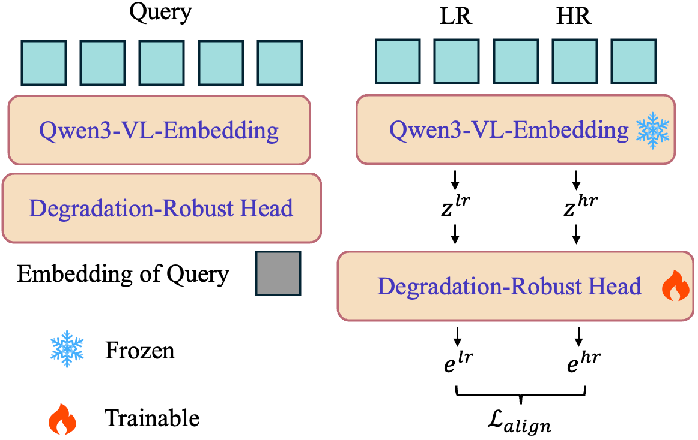
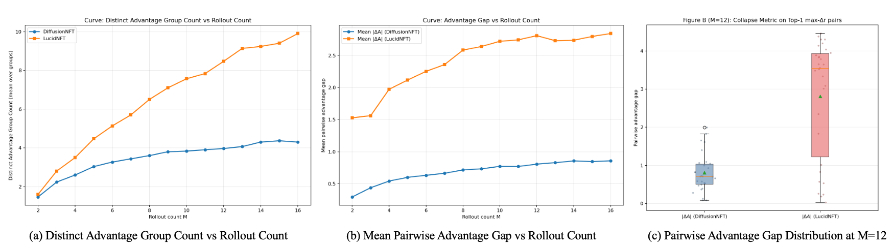
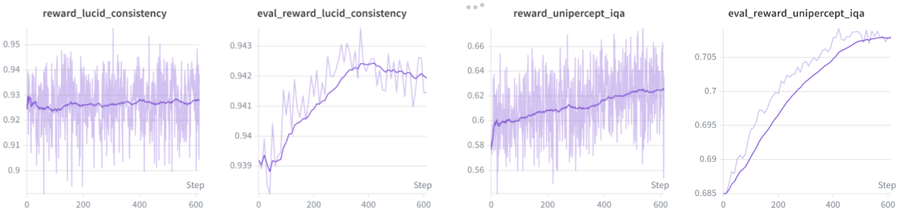
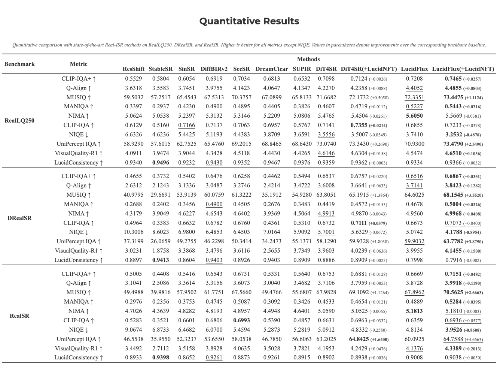
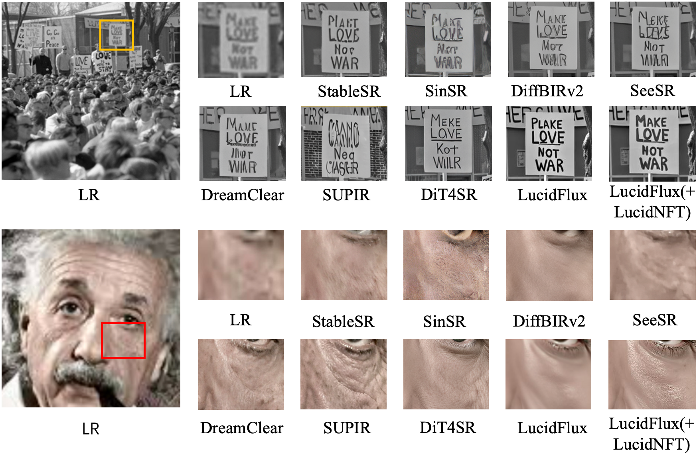
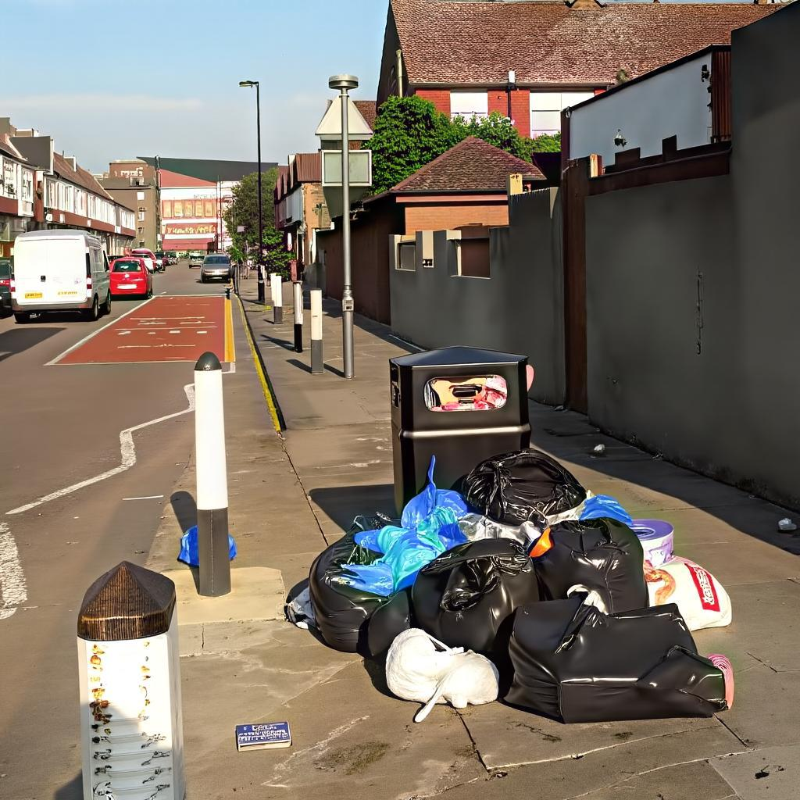

<div align="center">
<h1>LucidNFT:<br/>LR-Anchored Multi-Reward Preference Optimization for Generative Real-World Super-Resolution</h1>

### [**🌐 Website**](https://w2genai-lab.github.io/LucidNFT/) | [**📘 Arxiv**](https://arxiv.org/pdf/2603.05947) | [**🤗 Models**](https://huggingface.co/W2GenAI/LucidNFT)
</div>

---
## 📰 News & Updates

**[2026.03.26]** — Thanks to [smthemex](https://github.com/smthemex) for developing [ComfyUI_LucidNFT](https://github.com/smthemex/ComfyUI_LucidNFT). 


---
## 👥 Authors

> [**Song Fei**](https://feisong123.github.io)<sup>1, †</sup>, [**Tian Ye**](https://owen718.github.io)<sup>1, †</sup>, [**Sixiang Chen**](https://ephemeral182.github.io)<sup>1</sup>, [**Zhaohu Xing**](https://ge-xing.github.io)<sup>1</sup>, [**Jianyu Lai**](https://alexlai2860.github.io/)<sup>1</sup>, [**Lei Zhu**](https://sites.google.com/site/indexlzhu/home)<sup>1,2,*</sup>
>
> <sup>1</sup>The Hong Kong University of Science and Technology (Guangzhou)  
> <sup>2</sup>The Hong Kong University of Science and Technology
>
> † Equal Contribution, * Corresponding Author

---

<details open><summary>💡 We also have other projects on 4K text-to-image generation and photo-realistic image estoration that may interest you. ✨</summary><p>

> [**[CVPR 2026 Highlight] UltraFlux: Data-Model Co-Design for High-quality Native 4K Text-to-Image Generation across Diverse Aspect Ratios**](https://arxiv.org/pdf/2509.22414) <br>
> [**Tian Ye**](https://owen718.github.io/)<sup>1</sup>\*‡, [**Song Fei**](https://feisong123.github.io)<sup>1</sup>\*, [**Lei Zhu**](https://sites.google.com/site/indexlzhu/home)<sup>1,2</sup>† <br>
> [](https://github.com/W2GenAI-Lab/UltraFlux) [](https://github.com/W2GenAI-Lab/UltraFlux) [](https://arxiv.org/pdf/2509.22414) [](https://w2genai-lab.github.io/UltraFlux/) [](https://huggingface.co/Owen777/UltraFlux-v1) <br>

> [**[ICLR 2026] LucidFlux: Caption-Free Photo-Realistic Image Restoration via a Large-Scale Diffusion Transformer**](https://arxiv.org/pdf/2509.22414) <br>
> [**Song Fei**](https://feisong123.github.io)<sup>1</sup>\*, [**Tian Ye**](https://owen718.github.io/)<sup>1</sup>\*‡, [**Lujia Wang**](https://scholar.google.com/citations?user=c2_syKsAAAAJ)<sup>1</sup> , [**Lei Zhu**](https://sites.google.com/site/indexlzhu/home)<sup>1,2</sup>†</sup> <br>
> [](https://github.com/W2GenAI-Lab/LucidFlux) [](https://github.com/W2GenAI-Lab/LucidFlux) [](https://arxiv.org/pdf/2509.22414) [](https://w2genai-lab.github.io/LucidFlux/) [](https://huggingface.co/W2GenAI/LucidFlux) <br>

</p></details>

---

## 🌟 What is LucidNFT?

**LucidNFT** is a multi-reward preference optimization framework for **flow-matching real-world image super-resolution**. Built on top of **LucidFlux**, it improves perceptual quality while preserving **LR-anchored faithfulness** under diverse real-world degradations.

Compared with naive multi-reward preference optimization, LucidNFT focuses on the part that is actually difficult in Real-ISR: outputs may look realistic, yet drift away from the semantic and structural evidence contained in the low-quality input. LucidNFT addresses this with a faithfulness-aware reward design and a more stable multi-reward optimization strategy.

## Why LucidNFT?

- **Faithfulness is hard without HR ground truth.** In real-world SR, visually plausible outputs can still contradict the LR evidence.
- **Naive scalarized rewards are unstable.** Directly mixing heterogeneous reward objectives before normalization can compress rollout-wise contrasts and weaken preference optimization.
- **Perceptual metrics alone are insufficient.** Metrics that reward sharpness or realism do not directly measure LR-anchored faithfulness.
- **Real-world data diversity matters.** Small benchmark-only datasets limit rollout diversity and reduce the quality of preference signals.

## 🏗️ Method Overview

LucidNFT consists of three key ingredients:

1. **LucidConsistency.** A frozen Qwen3-VL embedding backbone plus a lightweight trainable projection head aligns LR and HR semantics in a shared representation space and yields a degradation-robust consistency score.
2. **Decoupled advantage normalization.** Each reward objective is normalized per rollout group before fusion, preserving perceptual-faithfulness contrasts and mitigating advantage collapse.
3. **LucidLR-supported preference optimization.** Large-scale real-world low-quality data improves degradation coverage and rollout diversity.

<div align="center">

<br>
<em><strong>Overview of LucidConsistency.</strong> Left: inference stage for LR-SR semantic consistency scoring. Right: training stage for projection-head optimization with LR-HR pairs.</em>
</div>

### Consistency Alignment

| Domain | Pairing | Baseline | LucidConsistency |
| --- | --- | ---: | ---: |
| Synthetic | LSDIR-Val (paired) | 0.759 | 0.890 (+0.131) |
| Real-World | RealSR | 0.799 | 0.925 (+0.126) |
| Real-World | DRealSR | 0.786 | 0.921 (+0.135) |
| Cross-Bench | RealSR LR ↔ DRealSR HR | 0.144 | 0.100 (-0.044) |
| Cross-Bench | DRealSR LR ↔ RealSR HR | 0.140 | 0.131 (-0.009) |

This is the core signal used to distinguish perceptually strong but semantically drifting outputs from those that remain faithful to the LR input.

## 📦 LucidLR Dataset

**LucidLR** is a 20K-image real-world low-quality dataset curated for preference optimization and unsupervised Real-ISR fine-tuning. It contains diverse natural degradations such as blur and compression artifacts, and provides stronger rollout diversity than small benchmark-oriented datasets.

<div align="center">

<br>
<em><strong>Representative examples from LucidLR.</strong></em>
</div>

| Dataset | Pairing | Primary Usage | Type | # Images |
| --- | --- | --- | --- | ---: |
| RealSR | Paired | Testing / Benchmark | Real-captured | 100 |
| DRealSR | Paired | Testing / Benchmark | Real-captured | 93 |
| RealLQ250 | Unpaired | Testing / Benchmark | Real-world | 250 |
| **LucidLR (ours)** | Unpaired | Preference Optimization / Unsupervised Training | Real-world | 20K |

## 📊 Performance Benchmarks

<div align="center">

<br>
<em><strong>Advantage separability analysis.</strong> LucidNFT yields stronger advantage gaps and higher separability than naive scalarized optimization.</em>
</div>

<div align="center">

<br>
<em><strong>Training dynamics.</strong> Both LucidConsistency and IQA-oriented rewards improve steadily during preference optimization on LucidFlux.</em>
</div>

According to the project page, LucidNFT improves the perceptual-faithfulness trade-off on top of LucidFlux across **RealLQ250**, **DRealSR**, and **RealSR**, while maintaining stable optimization behavior.

### 📈 Quantitative Results

Quantitative comparison with state-of-the-art Real-ISR methods on RealLQ250, DRealSR, and RealSR. Higher is better for all metrics except NIQE. Values in parentheses denote improvements over the corresponding backbone baseline.

<div align="center">

</div>

<div align="center">

<br>
<em><strong>Visual comparison on RealLQ250.</strong> LucidNFT further improves semantic consistency and perceptual quality over the baseline LucidFlux, producing more faithful structures and richer texture details.</em>
</div>

## 🎭 Gallery & Examples

<div align="center">

### LucidFlux vs LucidFlux(+LucidNFT)

<table>
<tr align="center">
  <td width="240"><b>LR</b></td>
  <td width="240"><b>LucidFlux</b></td>
  <td width="240"><b>LucidFlux + LucidNFT</b></td>
</tr>
<tr align="center">
  <td></td>
  <td></td>
  <td></td>
</tr>
<tr align="center">
  <td></td>
  <td></td>
  <td></td>
</tr>
<tr align="center">
  <td></td>
  <td></td>
  <td></td>
</tr>
<tr align="center">
  <td></td>
  <td></td>
  <td></td>
</tr>
</table>

</div>
---

## 🚀 Quick Start


### 🔧 Installation

```bash
git clone https://github.com/W2GenAI-Lab/LucidNFT.git
cd LucidNFT

python -m venv .venv
source .venv/bin/activate
pip install torch torchvision torchaudio --index-url https://download.pytorch.org/whl/cu128
pip install -r requirements.txt
```

### Prepare Weights

Run the downloader to populate `weights/` with the required assets, including the FLUX base model, SwinIR, LucidFlux checkpoint, prompt embeddings, LucidNFT LoRA, UltraFlux VAE, and SigLIP:

```bash
python -m tools.hf_login --token "$HF_TOKEN"
python -m tools.download_weights --dest weights
```

This script also generates `weights/env.sh`. Source it before inference so the FLUX base paths are exported correctly:

```bash
source weights/env.sh
```

### Inference

Run the LucidFlux baseline:

```bash
python inference.py \
  --checkpoint weights/lucidflux/lucidflux.pth \
  --control_image /path/to/lr_image_or_dir \
  --output_dir outputs \
  --width 1024 \
  --height 1024 \
  --num_steps 24 \
  --swinir_pretrained weights/swinir.pth \
  --siglip_ckpt weights/siglip \
  --offload
```

Run LucidFlux + LucidNFT LoRA:

```bash
python inference.py \
  --checkpoint weights/lucidflux/lucidflux.pth \
  --control_image /path/to/lr_image_or_dir \
  --output_dir outputs-lora \
  --width 1024 \
  --height 1024 \
  --num_steps 24 \
  --swinir_pretrained weights/swinir.pth \
  --siglip_ckpt weights/siglip \
  --lora_path weights/lucidflux/LucidFlux+LucidNFT_lora \
  --offload
```

### LucidConsistency Scoring

The repository also includes a lightweight LucidConsistency scoring entrypoint for comparing an `LR` image against an `HR/SR` image, or two benchmark folders with matched file counts. The learned projection-head score is reported as `LucidConsistency`.

Score a single image pair:

```bash
python test_LucidConsistency.py \
  --model_name_or_path weights/LucidConsistency/Qwen3-VL-Embedding-8B \
  --proj_head weights/LucidConsistency/proj_head.pt \
  --lr /path/to/lr.png \
  --hr /path/to/hr_or_sr.png
```

Score two benchmark folders:

```bash
python test_LucidConsistency.py \
  --model_name_or_path weights/LucidConsistency/Qwen3-VL-Embedding-8B \
  --proj_head weights/LucidConsistency/proj_head.pt \
  --lr /path/to/lr_benchmark \
  --hr /path/to/hr_benchmark
```

## Citation

```bibtex
@article{fei2026lucidnft,
  title={LucidNFT: LR-Anchored Multi-Reward Preference Optimization for Generative Real-World Super-Resolution},
  author={Fei, Song and Ye, Tian and Chen, Sixiang and Xing, Zhaohu and Lai, Jianyu and Zhu, Lei},
  journal={arXiv preprint arXiv:2603.05947},
  year={2026}
}
```

## License

This repository is released under the license specified in [LICENSE](LICENSE).

## Acknowledgments

- [LucidFlux](https://github.com/W2GenAI-Lab/LucidFlux)
- [FLUX](https://github.com/black-forest-labs/flux)
- [DiffusionNFT](https://github.com/NVlabs/DiffusionNFT)
- [Qwen3-VL-Embedding](https://huggingface.co/Qwen/Qwen3-VL-Embedding-8B)
